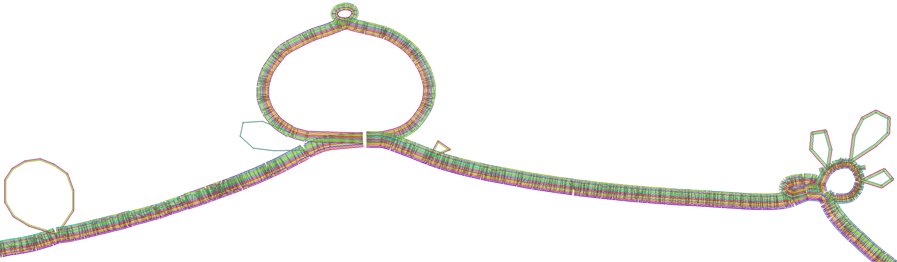

= *MemPanG23*
:figure-caption!:
:toc-title: Page Content
:toc: left
:toclevels: 2

A computational pangenomics course and virtual conference in Memphis, TN.

=== *Important Dates*

- Practical Course Registration Deadline: *1st April 2023*
- Selected Participant will be notified by: *10th April 2023*
- Payment Deadline: *20th April 2023*
- Virtual Conference Registration Deadline: *29th May 2023*

=== *Course Venue*

University of Tennessee Health Science Center +
Mooney Building, +
Library, Room 201, +
875 Monroe Ave., +
Memphis, TN 38163 +
United States +
-> https://goo.gl/maps/fCZbYYeGyUko353B8[See the venue on the map]

== *About the Practical Course*

*Tuesday, May 30, 2023 - Thursday, June 1, 2023* +
The use of a single reference genome in bioinformatics can lead to reference bias and miss important information about genome variability and relationships. New assembly methods have made it easier to generate high-quality complete genome assemblies, and using a pangenome graph that expresses many genomes and their mutual alignment can help address these issues. This course will focus on building such graphs from whole genome assemblies and using them in various downstream applications in comparative genomics, evolution, variation analysis, sequence alignment, and phenotype association.

Participants will learn about pangenome concepts and gain practical experience building and analyzing pangenome graphs. They will apply these methods to complex research questions that require understanding the relationships between multiple genomes or accounting for variability when analyzing new genomes. By the end of the course, participants will have a strong understanding of pangenome methods based on whole genome assemblies.

== *About the Virtual Conference*

*Friday, June 2, 2023* +
We will gather for a hybrid in-person and virtual conference on the last day of the week.
This will bring together course participants and virtual and in-person speakers who are actively working on diverse aspects of pangenome research.
The virtual meeting will be open to the public.
Speakers will cover topics at the intersection of pangenome methods and biology, including a focus on basic methods, data structures, genome assembly, data visualization, and public collaborative pangenome projects.
We expect to draw speakers from a diverse set of species contexts.

== *People*

=== *Practical Course Instructors*

==== Erik Garrison - Assistant Professor

.[purple]#University of Tennessee Health Science Center, Memphis, TN, US#

image:images/erik.jpeg[erik,200,role="right"] Genomicist with a quantitative social science background. I build methods that let us understand the precise relationships between thousands of genomes. In these, the genome is encoded in a graph that may represent a population sample of individuals from the same species, a metagenome, the diploid genome of a single individual, or any other useful collection of sequences.

image:images/Octicons-mark-github.svg[git,30] https://github.com/ekg[GitHub]

'''

==== Andrea Guarracino - Postdoctoral Scholar

.[purple]#University of Tennessee Health Science Center, Memphis, TN, US#

image:images/andrea.jpeg[erik,200,role="right"]Computer (bio)scientist dedicated to developing and applying new methods to analyze ever-larger collections of sequences (also called "pangenomes") in the tree of life.

image:images/Octicons-mark-github.svg[git,30] https://github.com/andreaguarracino[GitHub]

'''

==== Simon Heumos - PhD student

.[purple]#Quantitative Biology Center (QBiC), University of Tübingen, Tübingen, DE | Biomedical Data Science, Department of Computer Science, University of Tübingen, Tübingen, DE#

image:images/simon.png[simon,200,role="right"]

Bioinformatician by training. I am exploring methods to calculate and visualize pangenome graph layouts. These are key steps in pangenome graph construction and analysis pipelines. Cluster-scalable pangenomics is the next step.

image:images/Octicons-mark-github.svg[git,30] https://github.com/subwaystation[GitHub]

'''

=== *Practical Course Helpers*

==== Flavia Villani - PhD student

.[purple]#University of Tennessee Health Science Center, Memphis, TN, US#
image:images/Flavia.JPG[flavia,200,role="right"] I have a master degree in Medical Biotechnology from the University of Naples Federico II. Currently, I am a PhD student at the University of Tennessee Health Science Center. I am building the pangenome of model organisms (inbred mice and rats) using a combination of second and third generation sequence data.

image:images/Octicons-mark-github.svg[git,30] https://github.com/Flavia95[GitHub]

'''
==== Christian Fischer - IT Analyst III

.[purple]#University of Tennessee Health Science Center, Memphis, TN, US#
image:images/christian.jpeg[christian,200,role="right"]Computer scientist also trained in interaction design, with a love for mathematics. I work on tooling for variation graphs using the Rust programming language, with a special interest in visualization, which is currently channeled into my pangenome visualization tool Waragraph.

image:images/Octicons-mark-github.svg[git,30] https://github.com/chfi[GitHub]

{empty} +

=== *Virtual Conference Invited speakers*

TBA

=== *Organizers*

- link:https://andreaguarracino.github.io/[Andrea Guarracino], University of Tennessee Health Science Center, Memphis, TN, US
- link:https://github.com/DCGenomics[Ben Busby], Director, Solution Science at DNAnexus, Pittsburgh, Pennsylvania, US
- link:http://hypervolu.me/~erik/erik_garrison.html[Erik Garrison], University of Tennessee Health Science Center, Memphis, TN, US
- link:https://github.com/Flavia95[Flavia Villani], University of Tennessee Health Science Center, Memphis, TN, US
//- link:https://uthsc.edu/cbmi/big/big-faculty.php[Melanie Hayes], University of Tennessee Health Science Center, Memphis,TN,US
- link:https://thebird.nl/[Pjotr Prins], University of Tennessee Health Science Center, Memphis, TN, US
- link:https://www.uthsc.edu/faculty/profile/?netid=rdavis88[Robert Davis], University of Tennessee Health Science Center, Memphis, TN, US
- link:https://www.uthsc.edu/faculty/profile/?netid=rwilli10[Robert Williams], University of Tennessee Health Science Center, Memphis, TN, US
//- link:https://www.uthsc.edu/genetics/faculty-staff.php[Tamara Brock], University of Tennessee Health Science Center, Memphis,TN,US
- link:https://www.uthsc.edu/faculty/profile/?netid=vcolonna[Vincenza Colonna], University of Tennessee Health Science Center, Memphis, TN, US

image:images/UTHSC.png[uthsc,300]

- UTSHC, Department of Genetics, Genomics and Informatics
- College of Medicine, Department of Pediatrics

== *Program*

=== *Practical Course*
*Tuesday, May 30, 2023 - Day 1*

14:30 17:30 (16:00-16:30 coffee break)
    
*Session 1*

    - Presentation: introduction (what is a pangenome, why we need it, pangenome graph, variation graph, GFAv1, taste of pangenome graph construction)
    - Practical activities: simple pangenome graphs construction

*Wednesday, May 31, 2023 - Day 2*

09:30 12:30 (10:30-11:00 cofee break)

*Session 2*

    - Presentation: PanGenome Graph Builder
    - Practical activities: on HLA and LPA pangenome graphs

14:30 17:30 (16:00-16:30 coffee break)

*Session 3*

    - Presentation: Pangenome visualization (in 1D and 2D), graph sorting
    - Practical activities: Human pangenome graphs

*Thursday, June 1, 2023 - Day 3*

09:30 12:30 (10:30-11:00 cofee break)

*Session 4*

    - Presentation: ODGI (graph extraction and untangling)
    - Practical activities with ODGI

14:30 17:30 (16:00-16:30 coffee break)

*Session 5*

    - Practical activities: Saccharomyces cerevisiae (with sequence divergence estimation and community detection)
//        OPTIONAL: simple read mapping and variant calling (vg map/pack/call)
//        NOTE: we could replace this part with a genotyping session (bwa-mem, gfa-inject,gfapack, cosine distance)

=== *Virtual Conference*
Friday, June 2, 2023

- 09:30 - 10:00 talk 1
- 10:00 - 10:30 talk 2
- 10:30 - 11:00 break
- 11:00 - 11:30 talk 3
- 11:30 - 12:00 talk 4
- 12:00 - 14:00 lunch break
- 14:00 - 14:30 talk 5
- 14:30 - 15:00 talk 6
- 15:00 - 15:30 break
- 15:30 - 16:00 talk 7
- 16:00 - 16:30 talk 8

== *Registration and Practical Information*

Registration includes access to: all lectures and practical sessions, all course materials.

- link:https://forms.gle/oeku3F3crTDb5N8F6[Practical Course Registration form]

- link:https://forms.gle/PRKcQsz5Aivj1qg19[Virtual Conference Registration form]

=== *Cost*

The cost is intended for the course. The conference is free.

- Student - $200, with financial support if needed
- Industry - $400

=== *Selection criteria*

This course is intended for biologists and bioinformaticians interested in studying organisms with high genetic diversity or without a reference genome, as well as those involved in comparative genomics and the assembly of pangenomes for any species.

Selection of participants will be based on:

- good knowledge of Linux operating system and basic shell commands. This will be a mandatory prerequisite.
- familiarity with genomics data formats (e.g., FASTA, VCF, BED, ...) is a plus.
- impact of the course for the participant and his/her research group.
- stage of the research project: priority will be given to participants with data already available and ready to be analyzed (participants data will not be analyzed during the course).

Fulfillment of these conditions by participants will be assessed through the registration form.

[cols=">a,<a,<a", frame=none, grid=none]
|===
| image::images/memphis.jpg[width=300,height=300]
|image::images/men.jpg[width=600,height=400]
| image::images/bridge.jpg[width=300,height=300]
|===

https://www.memphistravel.com/sports-outdoors?gclid=Cj0KCQiAgOefBhDgARIsAMhqXA4Gt_kloBAAqe5LDWNW3199TI8DzRrUo4fCqSQ_cKLkRPd4xv46TUgaAt4WEALw_wcB[memphistravel]

{empty} +
{empty} +

== *Contact*

- mailto:genetics@uthsc.edu[genetics@uthsc.edu]
