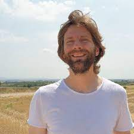

= *MEMPanG23*
:figure-caption!:
:toc-title: Page Content
:toc: left
:toclevels: 2

A computational pangenomics course and virtual conference in Memphis, TN

https://academic.oup.com/bioinformatics/article/35/24/5318/5542397[Sequence tube maps: making graph genomes intuitive to commuters]

== *Important Dates*

- Practical Course Registration Deadline: *1st April 2023*
- Selected Participant will be notify by: *10th April 2023*
- Payment Deadline: *20th April 2023*
- Virtual Conference Registration Deadline: *29th May 2023*

== *About the Practical Course (Tuesday, May 30th - Thursday, June 1st 2023)*

The use of a single reference genome in bioinformatics can lead to reference bias and miss important information about genome variability and relationships. New assembly methods have made it easier to generate high-quality complete genome assemblies, and using a pangenome graph that expresses many genomes and their mutual alignment can help address these issues. This course will focus on building such graphs from whole genome assemblies and using them in various downstream applications in comparative genomics, evolution, variation analysis, sequence alignment, and phenotype association.

== *About the Virtual Conference (Friday, June 2nd 2023)*

TBA

== *People*

=== *Practical Course Instructors*

=== Erik Garrison-Assistant Professor

.[purple]#University of Tennessee Health Science Center, Memphis, TN, US#

 Genomicist with a quantitative social science background. Harvard undergrad, Cambridge PhD. I build methods that let us understand the precise relationships between thousands of genomes. My work on this topic began with the development of Bayesian methods to detect and genotype genomic variants, with application of these methods to the thousands of human genomes cataloged in the 1000 Genomes Project. Lessons learned in that effort guided me to work on unbiased methods for genome inference based on graphical models of pangenomes. In these, the genome is encoded in a graph that may represent a population sample of individuals from the same species, a metagenome, the diploid genome of a single individual, or any other useful collection of genomic sequence information. I have shown that this approach provides more accurate alignment of reads when it is possible to construct a high-quality pangenome, and am currently applying it to the construction of pangenome graphs for humans as part of the HPRC.

image:images/Octicons-mark-github.svg[git,30] https://github.com/ekg[GitHub]

'''

=== Andrea Guarracino-Postdoctoral Scholar

.[purple]#University of Tennessee Health Science Center, Memphis, TN, US#

I am bioinformatician dedicated to the development and application of new methods to analyze collections of sequences (also called pangenomes). After a degree in computer engineering and an experience in a software company, he met biology by chance and fell in love with it. He then decided to pursue a master's degree in bioinformatics and then a PhD in the same field. During my doctorate, I explored chromosomal instability in colorectal cancer stem cells for the development of novel therapeutic approaches. In the middle of his research, "thanks" to the pandemic, I attended a virtual event where he encountered pangenomics and began actively working on developing new tools for building and analyzing pangenomes, which I am still currently doing.

image:images/Octicons-mark-github.svg[git,30] https://github.com/andreaguarracino[GitHub]

'''

=== Simon Heumos-PhD student

.[purple]#University of Tuebingen | EKU Tübingen · Quantitative Biology Center (QBiC)#

I currently works at the Quantitative Biology Center (QBiC), University of Tuebingen. My major focus is the visualization of genome variation graphs. I am doing research in Bioinformatics, Genetics and Software Engineering.

image:images/Octicons-mark-github.svg[git,30] https://github.com/subwaystation[GitHub]

'''

=== *Practical Course Helpers*

=== Flavia Villani-PhD student

.[purple]#University of Tennessee Health Science Center, Memphis, TN, US#
image:images/Flavia.JPG[flavia,200,role="right"] I have a master degree in Medical Biotechnology from the University of Naples Federico II. Currently, I am a PhD student at the University of Tennessee Health Science Center. I am building the pangenome of model organisms (inbred mice and rats) using a combination of second and third generation sequence data.

image:images/Octicons-mark-github.svg[git,30] https://github.com/Flavia95[GitHub]

'''
=== Christian Fischer-IT Analyst III

.[purple]#University of Tennessee Health Science Center, Memphis, TN, US#
image:images/christian.jpeg[christian,200,role="right"] I am part of Erik's group at UTHSC in Memphis, TN. I am a scientific software engineer with many interests and am aiming for a PhD on pangenomes and logic programming. I am a true lambda coder with a love for Haskell, Purescript, APL, Rust and Lisps. 

image:images/Octicons-mark-github.svg[git,30] https://github.com/chfi[GitHub]

{empty} +

== *Organizers*

- link:https://andreaguarracino.github.io/[Andrea Guarracino], University of Tennessee Health Science Center, Memphis,TN,US
- link:https://github.com/DCGenomics[Ben Busby], Director, Solution Science at DNAnexus,Pittsburgh, Pennsylvania,US
- link:http://hypervolu.me/~erik/erik_garrison.html[Erik Garrison], University of Tennessee Health Science Center, Memphis,TN,US
- link:https://github.com/Flavia95[Flavia Villani], University of Tennessee Health Science Center, Memphis,TN,US
- link:https://uthsc.edu/cbmi/big/big-faculty.php[Melanie Hayes], University of Tennessee Health Science Center, Memphis,TN,US
- link:https://thebird.nl/[Pjotr Prins], University of Tennessee Health Science Center, Memphis,TN,US
- link:https://www.uthsc.edu/faculty/profile/?netid=rdavis88[Robert Davis], University of Tennessee Health Science Center, Memphis,TN,US
- link:https://www.uthsc.edu/faculty/profile/?netid=rwilli10[Robert Williams], University of Tennessee Health Science Center, Memphis,TN,US
- link:https://www.uthsc.edu/genetics/faculty-staff.php[Tamara Brock], University of Tennessee Health Science Center, Memphis,TN,US
- link:https://www.uthsc.edu/faculty/profile/?netid=vcolonna[Vincenza Colonna], University of Tennessee Health Science Center, Memphis,TN,US

    UTSHC, Department of Genetics, Genomics and Informatics
    College of Medicine, Department of Pediatrics

== *Virtual Conference Invited speakers*

TBA

== *Program*

=== Practical Course
*Tuesday, May 30 - Day 1*

    14:30 17:30 (16:00-16:30 coffee break)
    
    Session 1
        - Presentation: introduction (what is a pangenome, why we need it, pangenome graph, variation graph, GFAv1, taste of pangenome graph construction)
        - Practical activities: simple pangenome graphs construction

*Wednesday, May 31 - Day 2*

    09:30 12:30 (10:30-11:00 cofee break)

    Session 2
        - Presentation: PanGenome Graph Builder
        - Practical activities: on HLA and LPA pangenome graphs

    14:30 17:30 (16:00-16:30 coffee break)

    Session 3
        - Presentation: Pangenome visualization (in 1D and 2D), graph sorting
        - Practical activities: Human pangenome graphs

*Thursday, June 1 - Day 3*

    09:30 12:30 (10:30-11:00 cofee break)

    Session 4
        - Presentation: ODGI (graph extraction and untangling)
        - Practical activities with ODGI ()

    14:30 17:30 (16:00-16:30 coffee break)

    Session 5
        - Presentation: MISSING
        - Practical activities: Saccharomyces cerevisiae (with sequence divergence estimation)

    Session 6
        - Presentation: MISSING
        - Practical activities:
            Saccharomyces cerevisiae (with community detection)
            OPTIONAL: simple read mapping and variant calling (vg map/pack/call)
            NOTE: we could replace this part with a genotyping session (bwa-mem, gfa-inject,gfapack, cosine distance)

== *Virtual Conference*
Friday, June 2

- 09:30 - 10:00 talk 1
- 10:00 - 10:30 talk 2
- 10:30 - 11:00 break
- 11:00 - 11:30 talk 3
- 11:30 - 12:00 talk 4
- 14:00 - 14:30 talk 5
- 14:30 - 15:00 talk 6
- 15:00 - 15:30 break
- 15:30 - 16:00 talk 7
- 16:00 - 16:30 talk 8

== *Registration and Practical Information*

- link:https://forms.gle/oeku3F3crTDb5N8F6[Practical Course Registration form]

- link:https://forms.gle/PRKcQsz5Aivj1qg19[Virtual Conference Registration form]

== *For who*

This course is intended for biologists and bioinformatics interested in studying organisms with high genetic diversity or without a reference genome, as well as those involved in comparative genomics and the assembly of pangenomes for any species.

== *Why*

Participants will learn about pangenome concepts and gain practical experience building and analyzing pangenome graphs. They will apply these methods to complex research questions that require understanding the relationships between multiple genomes or accounting for variability when analyzing new genomes. By the end of the course, participants will have a strong understanding of pangenome methods based on whole genome assemblies.

== *Where*

University of Tennessee Health Science Center
XXXXXXXX building
Memphis, Tennessee
United States
- https://www.google.com/maps/place/The+University+of+Tennessee+Health+Science+Center/@35.1408087,-90.0328048,17z/data=!3m1!4b1!4m6!3m5!1s0x87d57e649fa0bfe5:0x2306e2eb0a1d3690!8m2!3d35.1408087!4d-90.0306161!16zL20vMDRtNGpo[map]

[cols=">a,<a,<a", frame=none, grid=none]
|===
| image::images/memphis.jpg[width=300,height=300]
|image::images/men.jpg[width=600,height=400]
| image::images/bridge.jpg[width=300,height=300]
|===

https://www.memphistravel.com/sports-outdoors?gclid=Cj0KCQiAgOefBhDgARIsAMhqXA4Gt_kloBAAqe5LDWNW3199TI8DzRrUo4fCqSQ_cKLkRPd4xv46TUgaAt4WEALw_wcB[memphistravel]

== *Cost*

    Student prices - $200, with financial support if needed
    Industry prices - $400

{empty} +
{empty} +

== *Contacts*

- mailto:mhayes74@uthsc.edu[Melanie Hayes]
- mailto:tbrock5@uthsc.edu[Tamara Brock]
